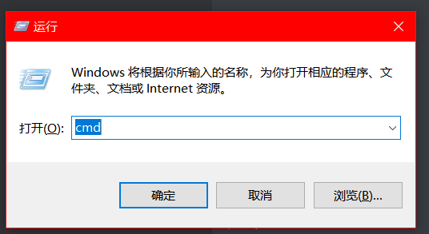
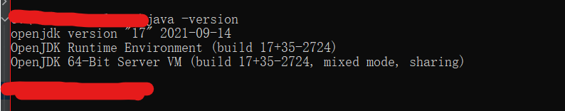
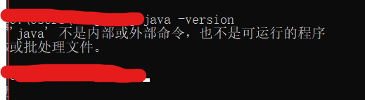
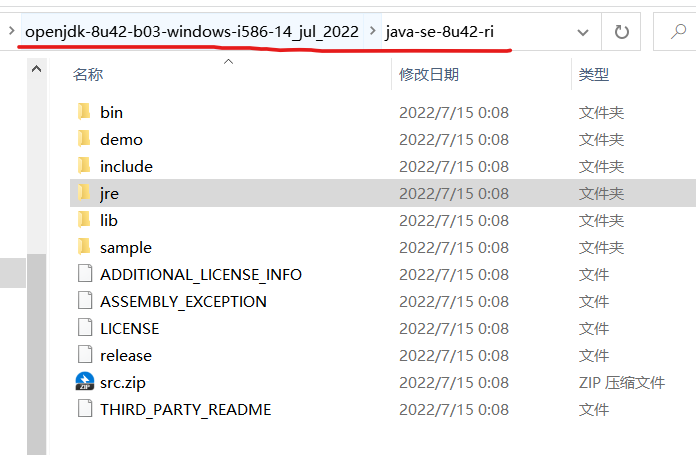
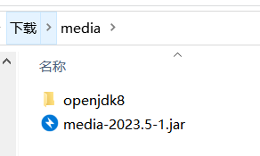
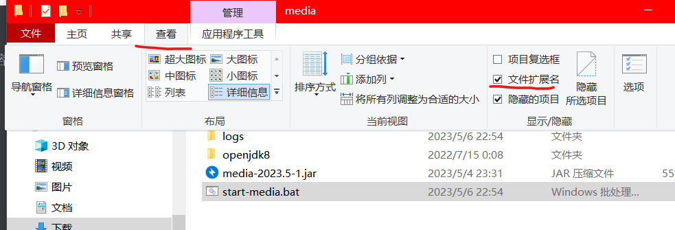
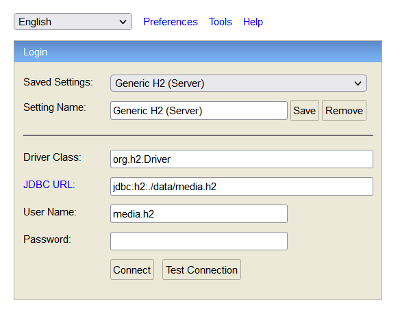
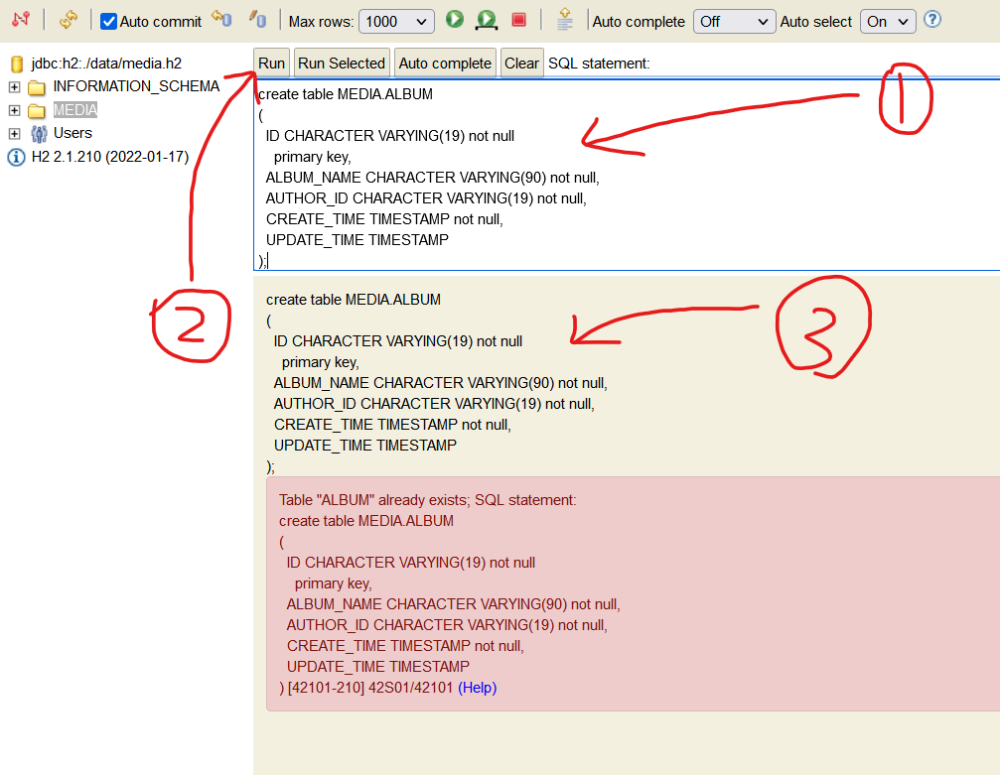
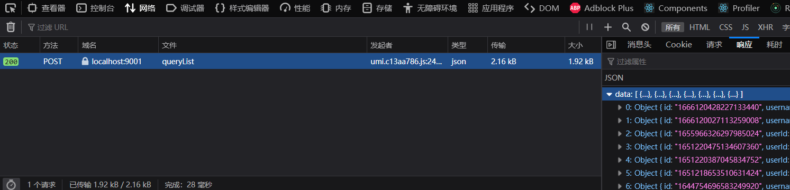

# 素材管理系统

- 当前版本：v2023.5-1
- 后台代码版本：v0.2.1-alpha
- 前台代码版本：v0.2.0-alpha

一个用来管理本地素材的系统，目前处于开发阶段，所有发布版本都属于 alpha 版本。

> 如果需要导入已有资源，可以查看本文的**导入已有资源**。

## 获取方式

本系统是一个基于 springboot 和 antd-pro 的 web 系统，获取本系统有两种方式，第一种是拉代码到本地自己启动，第二种是在 actions 页面下载制品然后启动。如果拉代码到本地启动，则需要 jdk8 和 
node14。在发布第一个 1.0.0 稳定版后会按实际需要逐步升级使用的框架。鉴于不是所有用户都有 github 账号，因此所有发行版本都会通过[百度云链接](https://pan.baidu.
com/s/1PG5RF-4ZDna0ZzOwoudFLg?pwd=ffaw)分享。

**注意**：不管是从 actions 下载还是从百度云下载，如果文件名是 `media-package-版本号.jar` ，则说明这个版本是一个预览版。如果是 `media-master-版本号.jar` 
，则是正式发行版。发行版由 `master` 分支打包，预览版由 `package-*` 分支打包。

### github actions

本系统前后台代码都配置了 github actions，每个仓库都配了两个工作流，在推送发布分支和主分支时会执行工作流。两个工作流简要说明如下：

- `release-build/release-package`：这两个工作流内容完全相同，只有文件名和工作流名不同。推送 `master` 或 `build-*` 和 `package-*` 分支时会执行。`build-*` 是前台的发布分支，`package-*` 是后台的发布分支。在功能开发完成后，会先将开发分支合并到发布分支，测试无误后再合并到 `master` 主分支。工作流产物是一个可执行 jar 包，jar 中包含编译好的前台产物，因此不需要 nginx 做代理。
- `npm-build` 和 `mvn-package` ：这两个工作流执行时间和 `release-build/release-package` 相同，单独打包前台代码和后台代码，前台产物需要通过 nginx 代理到后台。

> **注意事项**: <br/>
> release 工作流打包的是最新的发布分支，因此每次开新发布分支时都要修改工作流并提交。假设现在前后台发布分支分别为 `build-0.2.0-alpha` 和 `package-0.2.
> 1-alpha`，则工作流执行完成后，如果向前台发布分支提交了新代码，则后台仓库的发布产物会失效，因为后台执行工作流时用的前台代码不是最新的。反过来也一样。目前暂时没有很好的方法解决这个问题。

> **注意事项**：<br/>
> `master` 分支的工作流制品始终是最新。假如先向后台仓库推送代码，再向前台仓库推送代码，这种情况下，前台仓库打包的代码是最新的，而后台代码打包时使用的前台代码是上一次的版本，因此我会手动再调一次后台工作流。

## 启动和部署

### 运行环境

如果拉代码后在本地启动，则需要 node14 和 java8+。注意：**前台的 ant-design-pro 版本是 4.5.0，因此不兼容高版本 node。我本地开发用的是
node14，如果用 node18 运行，则会抛出异常
**。启动后台只需要 java8+。如果你使用的是 release 工作流的产物，则只需要 java8+ 。如果本地没有安装 jdk，可以[点击下载openjdk8](https://download.java.net/openjdk/jdk8u42/ri/openjdk-8u42-b03-windows-i586-14_jul_2022.zip)。

### 检查是否安装jdk

首先打开命令行，方式是按 <kbd>win</kbd> + <kbd>r</kbd>，然后输入 cmd：



在弹框中输入 `java -version`，如果显示和下面相似的内容，则说明已安装 java，可以跳到部署章节。**注意，版本号会随项目进度变动，且不是中文
**。



如果运行结果是下图，则说明没有安装 java，可以[点击下载jdk8](https://download.java.net/openjdk/jdk8u42/ri/openjdk-8u42-b03-windows-i586-14_jul_2022.zip)，然后参考以下内容进行部署。



下载 jdk8 后，解压后得到以下内容：



这个目录很长，我建议是将最里面的 `java-se-8u42-ri` 挪出来，比如挪到 `c:/users/你的用户名/downloads/media`下，然后改名 `openjdk8` ，之后将制品也下载到 `c:/users/你的用户名/downloads` 下面，然后你会得到下面的内容：



在这里新建一个文本文件，将下面的内容复制进去，然后将扩展名改为bat。

```bat
call openjdk8\jre\bin\java -Dspring.profiles.active=prd -jar media-2023.5-1.jar
call cmd \k
```

如果你的文件名是 新建文本文档.txt，则改完后应该是 `新建文本文档.bat` 。如果你的文件名是 `新建文本文档` 而不是 `新建文本文档.txt` ，请点击菜单栏的查看，然后勾选红线上面的框：



修改完成后，双击 `新建文本文档.bat` 就可以启动系统了。启动后你会看到多了一个 `data` 目录和 `logs` 目录，`data` 目录是存放系统数据的地方，最好不要动这个目录和里面的文件。`logs` 目录是日志目录，里面会保存两个月的日志文件，超过两个月的日志文件会自动删除。

### 部署

下载 release 工作流的产物后，通过 `java -Dspring.profiles.active=prd -jar media-版本号.jar` 启动工程，启动后会多出一个 `data` 目录和 `logs` 目录，前者保存系统数据，最好不要动里面的文件，后者保存系统日志，60天后自动删除。启动后打开浏览器访问 `http://localhost:9001/api` 即可。如果是第一次启动，则会报错，此时需要访问 `http://localhost:9001/api/h2`，打开后会看到以下界面，在 password 栏输入 media.h2 后点击 connect 进入控制台。



进入控制台后，将后台仓库中的 `sql/initialize/media.sql` 复制到输入框 1，然后点击 2 run，之后就可以在 3 里看到运行结果。运行 sql 可以点 run 页可以点 run selected。



如果系统升级到下个版本后有数据库变动，则会将变动语句放在后台仓库的 `sql/update/版本号`，同时修改 `sql/initialize/media.sql` 中的建表语句。如果版本升级没有修改数据库，则不存在目录 `sql/update/版本号` 。

## 版本发布

本系统代码仓库采用常规发布，每一个需求都会从主分支开一个开发分支 `dev-202305-1` ，命名规则是 `dev-月份-需求序号` 。比如 `dev-202305-1` 就表示五月第一个需求。如果是修复线上 bug，则分支名为 `fix-202305-1`，表示五月第一个线上 bug。

需求开发完成后，会从主分支开一个发布分支，前台发布分支是 `build-下一个版本号` ，后台发布分支是 `package-下一个版本号` 。然后将开发分支合并到发布分支，测试无误后再合并到主分支，同时发布新版本。

### 版本号规则

代码版本遵循[语义化版本](https://semver.org/lang/zh-CN/)，制品版本遵循[日历化版本](https://calver.org/overview_zhcn.html)
。**注意：由于个人原因，目前编写的ci配置不能实现打包产物使用日历版本。**此外，打包时使用的前后台代码版本可以在jar包的 `BOOT-INF/classes/static/ui-version.txt` 和
`BOOT-INF/classes/static/server-version.txt` 中找到，其中的内容是 `git log -1` 的运行结果。系统启动后也可以直接通过浏览器访问该文件。

> 注意事项
>
> 1. 目前前后台代码存放在两个仓库，且版本号不同步，将来也不会同步。
> 2. release 工作流的产物使用的是后台版本号，不能代表整体版本。用户可以在最终 jar 包的 `BOOT-INF/classes/static/*-version.txt` 中查看改 jar 包对应的前后台代码版本（git提交哈希值）。
> 3. 根据语义化版本规则，如果某个版本中，前台只改了 bug，但是后台有很多变动，则前台代码修订版本号会加一，而后台代码次版本号会加一，时间久了以后，前后台代码版本会出现较大差异。
> 4. 主版本号始终是同步的。

### 版本升级

按以下步骤升级：

1. 备份 `data` 目录。
2. 运行后台仓库的 `sql/update/版本号` 中的 sql。
3. 启动。

## 导入已有资源

本系统支持从指定目录导入资源，导入时可以使用[正则表达式](https://www.runoob.com/regexp/regexp-tutorial.html)来过滤或者包含指定资源。可以
时目录，也可以是文件。

### 步骤

1. 解压从actions页面下载到的制品 `application-版本号.jar` 。
2. 进入解压后的`BOOT-INF\lib`目录。
3. 将actions页面下载的 `cli-版本号.jar` 复制到上面的 `BOOT-INF\lib` 目录。
4. 打开控制台，通过运行下面的命令将资源导入系统：

```
java -cp .\* com.sheepfly.media.LoadDirectory -t 要导入的目录 -a 作者姓名
```

可以输入 `java -cp .\* com.sheepfly.media.LoadDirectory -h` 查看可以使用哪些参数。

> **注意**：数据目录 `data` 必须和 *.jar 文件位于同一目录，建议操作之前先备份 `data` 目录。

### 指定资源作者

作者参数可以通过 `-a` 或 `-ai` 参数传入，`-a` 传入的是作者用户名，`-ai` 传入的是作者在系统中的唯一标识符。如果所有作者的用户名都没有重复，则可以只通过 `-a` 参数传入作者用户名，如果有重名，则必须使用
`-ai` 参数传入唯一标识符。当重复的用户名小于等于 5 时，会在命令行输出所有重复用户名，如果大于 5 ，则需要自行输入用户唯一标识。

> 用户唯一标识可以使用浏览器自带的开发工具查看。右边每一列的 id 就是唯一标识。
> 

### 指定要包含哪些资源

包含路径通过 `-inp` 传入，需要注意的是，**包含路径必须是目标目录的一级子目录
**。假如有目录 `/a/b/c` ，则 `-inp .*b` 可以扫描到 `/a/b/c` ，因为 b 是 a 的一级子目录，而 `-inp .*c`
就不能扫描到 `/a/b/c` ，而且由于 a 的一级子目录是 b，导致不仅 c 不会被扫描，b 也不会被扫描。

在目录前加 `.*` 是为了在扫描子目录时以然能匹配 b 目录，即 `/a/b` 可以匹配正则表达式 `.*b` 而不能匹配 `b` 。另外，如果要包含路径中有指定字符的资源，应该使用 `.*目标字符.
*` 。

假如你有一个文件夹保存了一些歌曲，路径格式为 `歌手/发行时间yyyy-mm-dd/专辑/歌手名-歌曲名.mp3` ，如果你想扫描 2023 年的所有歌曲，你应该输入 `-inp .*2023.*` 
。假如你想扫描某歌手的某专辑的所有歌曲，你要将目标目录改为专辑目录，而不是使用 `-inp` 参数。

### 指定要排除哪些资源

排除资源通过 `-exp` 传入。要排除的目录/资源可以是目标目录的任意级子目录，但是如果要排除路径中包含指定字符串的资源，依然需要使用正则表达式。还是以上面的歌手为例。如果你要排除某个专辑，你需要使用 `-exp 专辑`，而不是 
`-exp .*专辑` 。这一点和 `-inp` 参数不同。

### 重复资源处理

当两个资源的所在目录和文件名相同时，就认为扫描到了重复资源，此时不会将该资源扫描到系统，而是会跳过该资源，同时将资源路径写入 `result.dup.txt` 。

### 运行结果

运行后，当前目录会生成多个文本文件，文件名和作用分别为：

- result.txt: 录入系统中的资源。
- result.dup.txt: 重复资源。重复资源不会录入，判断重复的条件是资源目录和资源文件名相同。
- result.ex.txt: 满足 `-exp` 参数的资源。
- result.inc.txt: 满足 `-inp` 参数的资源。
- result.fail.txt: 录入失败的资源。

> 这些文件在扫描时暂时没有排除，你可以在每次运行后将他们移动到别的地方。**强烈不建议直接删除这几个文件**。
